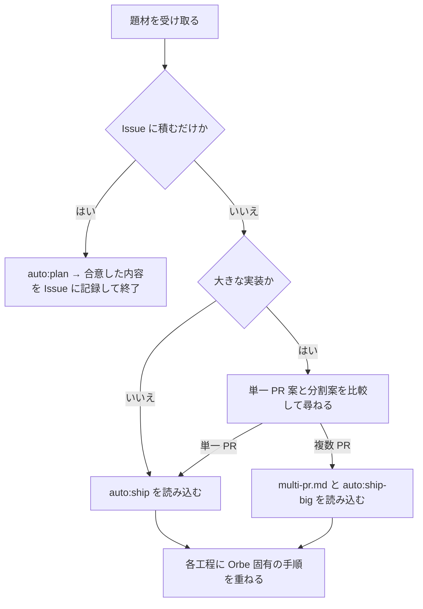
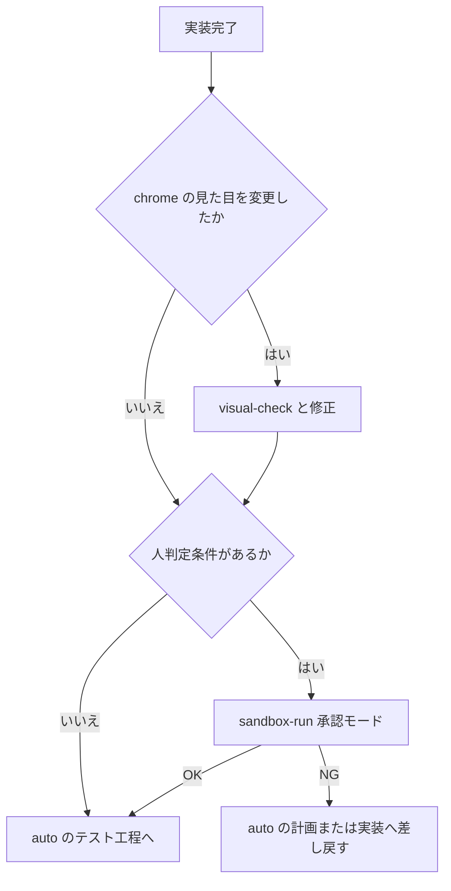

# ship — Orbe の開発を auto の工程で運ぶ

共通の進行は `auto:ship` または `auto:ship-big` が持ち、このスキルは Orbe のビルド・見た目・実機確認・spec の扱いを重ねる。auto のスキル群はメンテナのプラグイン環境にある。

## 受付と規模の選択

1. リポジトリの `CLAUDE.md` / `CLAUDE.local.md` があれば Read で読み、`docs/spec/README.md` を Read で読む。
2. `$ARGUMENTS` の直接指示、または `gh issue view` で読んだ Issue を題材にする。題材が無ければ Issue の候補を示して選んでもらう。既に決まっている完了条件・制約・設計は引き継ぎ、ユーザーにしか分からない不足だけを聞く。
3. 実装を始める依頼では、下記の基準で進め方を選ぶ。選択後、対応するスキルを読み込み、**同じ最上位 main で**その工程を実行する。

**大きな実装では、単一 PR で進める案と、`auto:ship-big` で複数 PR に分ける案を比較して尋ねる。** 大きさは、一度に設計・検証・レビューする負担と、独立した完了条件や依存順を持つ単位へ分ける価値で判断する。例えば、基盤整備から移行・旧経路の撤去へ段階を踏む変更や、複数領域にまたがる機能群。

分割の見立て・依存関係・単一 PR で進める負担を短く示し、推奨を添えて `AskUserQuestion` で選んでもらう。既に進め方の指定があれば引き継ぐ。受付では分からず計画中に規模が判明した場合も、実装前にこの選択へ戻る。切り替え時は先の進行を止め、元の源流と計画を引き継ぐ。今回作った旧作業場は、必要な計画を保存し、未保存の変更が無いことを確かめてから片付ける。

- **単一 PR**: `Skill` ツールで `auto:ship` を読み込む。
- **複数 PR**: `references/multi-pr.md` を Read で読み、`Skill` ツールで `auto:ship-big` を読み込む。全体計画・統合時の Orbe の扱いはその reference に従う。
- **Issue に積むだけ**: `auto:plan` の SKILL.md を Read で読み、その呼び出し規約でバックグラウンド Agent を起動する。題材・リポジトリのパス・関係する spec を読む指示を渡し、要件相談を人へ取り次ぐ。返った計画書を Read で読んで人と合意し、完了条件と設計を Issue に記録して終了する（既存 Issue なら本文を更新、直接指示なら新規作成）。この入口では実装用のブランチ・worktree を作らない。実装の計画承認時に「積むだけ」へ変わった場合も、合意内容を Issue に記録し、必要な計画を保存してから今回作った作業場を片付ける。

## auto の工程へ重ねる Orbe 固有の手順

以下は、`auto:ship` では一つの PR、`auto:ship-big` では各単位に適用する。源流・worktree・実行水準・委譲と相談・テストの検分・レビューの裁定・差し戻し・マージ承認は、選んだ auto スキルに従う。作業場を以下 `<wt>` とする。

### 調査・計画 — 完了条件と確認手段

`auto:plan` に `docs/spec/README.md` と関係する spec を Read で読ませ、Orbe の現状を前提に計画させる。設計の重さは題材に合わせ、要件に無い拡張を盛らない。完了条件は観察できる結果で書く。

完了条件のうち、見た目・操作感など人が実物で判断するものを**人判定条件**として明示する。その確認手段には、`<wt>` のビルドを `sandbox-run` で隔離起動することと、条件ごとの触りどころを含める。

計画書は `auto:plan` が返したパスを後続へ渡す。別の作業場からも読める絶対パスで保持し、ローカルの計画書はコミットしない。承認時の提示内容と実行水準は、選んだ auto スキルの計画承認手順に従う。

### 実装・修正 — ビルドと spec を作業者へ渡す

`auto:implement` には計画書パスまたは修正指示と `<wt>` を渡し、`docs/guides/build.md` を Read で読ませる。worktree の libghostty の準備は同文書と `scripts/build-app.sh` に従う。

**`Sources/` を変更する作業者は、終了前に該当 spec も現状へ更新する。** spec はコードと別のコミットにまとめる。

spec には現状の挙動・契約・境界と、その形が必要な設計意図を書く。今回の変更理由・比較検討・採否の経緯は PR 本文に残す。spec の編集も作業者が行い、ship は結果を取り次ぐ。

### 実装から体験判定へ — 見た目を揃え、実物を渡す

chrome の見た目を変えたときは、実装作業者に `visual-check` を実行させる。`<wt>`・対象の画面と状態・見本の所在（呼び出し元から渡されていればそれ）を渡し、本物の中身で **preview → アクションで現れる状態は flow** の順に確かめさせる。見本との一致、理由付きの逸脱、見本に到達できない場合の design-system 準拠は `visual-check` の基準に従う。修正・spec 更新・コミットまで済ませ、画像のパスと対応要約を返させる。

人判定条件があるときは、`<wt>` の `build/Orbe.app` を対象に `sandbox-run` の承認モードを呼ぶ。条件ごとの触りどころと build-id を示し、合否を人に判定してもらう。**呼び出し時に、ここで取るのは体験判定であり、マージは完成した PR とマージ先を提示して別途承認を取ることを指定する。** 隔離起動・煙探知・後片付けは `sandbox-run` が持つ。

NG の差し戻しは、期待・設計が変わるなら計画へ、承認済み計画を実装が満たしていないなら実装へ戻す。後続で人判定条件に影響する修正が入ったときは、その条件を再確認する。

### テスト・機械検証 — 既存の基盤で結果を確かめる

`auto:implement-test` には、auto が定める差分・計画書（テスト自体が題材なら要求）に加え、`docs/testing/test-architecture.md` と `docs/testing/roadmap.md` を Read で読む指示を渡す。前者は層と横断方針、後者は実装済みの範囲を持つ。該当スライスの進捗が変われば作業者にロードマップも更新させる。

- テストは XCTest を使い、`Tests/OrbeTests` では `OrbeTestCase` の隔離ハーネスを通す。`swift test --parallel` は使わない。
- ビルド・lint・format は `docs/guides/build.md`、CI の実行内容は `.github/workflows/ci.yml` を Read で確かめる。`<wt>` の依存を用意してから `swift build --build-tests` → `swift test --skip-build` を実行する。追加するテストは今回の振る舞いと既存の網から判断し、検分では仕様との対応と書かなかった理由を見る。

テストの検分後、**完了条件を独立に確かめる Agent** を起動する。渡すのは完了条件・`<wt>`・検証に必要な上記文書の所在。実装者の成功申告や採用設計は渡さない。既存テスト・制御 API・ログ等から手段を選び、条件ごとに「合格 / 不合格 / 人の判定が必要」と、根拠・検証したコミットを返させる。検証用の使い捨てファイルは worktree 外の scratch に置かせ、成果物の修正は実装工程へ返す。

アプリの挙動・起動経路・同梱物を変えた場合は、`sandbox-run` の煙探知を通す。体験判定で対象ビルドの煙探知が済んでいれば、その結果を使う。それ以外は無人モードで起こし、隔離先の socket だけを操作して、検証後に片付ける。確認済みの挙動へ修正が入った場合は、影響する条件を再検証する。

不合格は auto の計画または実装へ差し戻す。新たに人の判定が必要と分かった条件は、体験判定へ戻して結果を揃える。

### PR・レビュー・マージ — 最終差分と判断の記録を揃える

PR 作成までに、必要な spec 更新を作業者が完了していることを確認する。PR 本文は `auto:pull-request` で ship が直接作成・更新し、完了条件・採用設計と判断理由・意味のある棄却案・検証の証拠・視覚確認と体験判定の結果を記す。題材の Issue を関連付け、解決するものには `Closes #N` を記す。

レビューは `auto:review` の採否案を、要求・計画・体験判定の経緯と突き合わせて裁定する。採択した修正は auto の本線へ差し戻し、spec と PR 本文も追従させる。マージ承認時には、レビュー後の変更・裁定結果・検証結果と、作業ブランチおよびマージ先を提示する。

### 源流へのマージ後 — ローカル反映

ローカル反映の希望が未指定なら、源流へのマージ承認時に `/Applications/Orbe Dev.app` へ反映するかも尋ねる。既に依頼・承認されていれば引き継ぐ。

許可された場合は、マージ後の源流コミットを指すクリーンな作業場を用意し、そこで `local-release` を呼ぶ。結果と build-id の報告は同スキルに従う。
