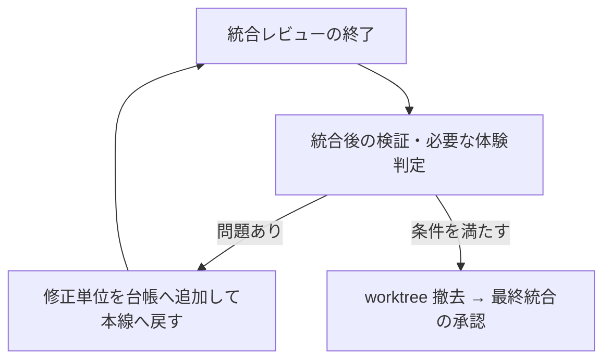

# 複数 PR で運ぶときの Orbe の手順

リポジトリの `ship` で `auto:ship-big` を選んだときに読む。`auto:ship-big` を同じ最上位 main で実行し、全体計画・台帳・統合ブランチ・各単位の worktree・承認と差し戻しは同スキルに従う。

`auto:ship-big` が各単位の作業者を直接編成し、**ship 本文の Orbe 固有の手順を各単位の計画・実装・テスト・PR へ重ねる。**

## 全体計画と台帳

1. 各単位の完了条件に、人判定条件と確認する画面・操作を含める。複数単位が揃って初めて確認できる条件は、全体計画に統合後の確認条件として残す。
2. 台帳は `auto:ship-big` の指定形式を使う。各単位の「結果要約」に、spec 更新・機械検証・視覚確認・体験判定の結果と証拠のパスを残す。検証したコミット、実機確認した build-id、未判定の条件も記録し、再開時に読めるようにする。

## 各単位の実行

- 詳細計画では、単位の `<wt>` を前提に Orbe の spec と確認手段を計画へ入れる。
- 実装後、テストへ渡す前に ship 本文の視覚確認と体験判定を通す。**人への体験判定は逐次**で行い、どの単位・build-id を触っているかを明示する。テストだけの単位は auto の入口に従う。
- テストの検分後に、単位の完了条件の独立検証を行う。失敗・指摘は単位の計画または実装へ戻し、他単位の前提も崩れるなら `auto:ship-big` の全体計画へ戻す。
- spec 更新は各単位の作業者がその PR に含める。単位 PR のマージ先は統合ブランチであり、承認時にもその行き先を示す。

## 統合後の確認と源流への引き渡し

統合レビューが収束または打ち切りになった後、**レビュー用 worktree を撤去する前に**、統合後の全体条件を確かめる。

1. 統合ブランチ上でビルド・テストを実行し、PR 境界をまたぐ完了条件を独立検証の Agent に確認させる。アプリに影響する変更では、統合したビルドを `sandbox-run` で隔離起動して煙探知を通す。
2. 統合後に初めて成立する画面・操作について、該当する視覚確認と人の体験判定を行う。結果・証拠・対象コミットと build-id を台帳の進捗ログへ残す。
3. 問題が出たら `auto:ship-big` の修正単位として台帳へ追加し、本線の実装・テスト・レビューを通す。修正が統合されたら影響する確認を再実行し、判定を揃えてから worktree を撤去する。
4. 最終統合 PR に、全体の完了条件・各単位の結果・統合レビューと統合後の検証結果をまとめ、統合ブランチから源流へのマージ承認を取る。ローカル反映は、この最終統合後に ship 本文の手順で行う。

