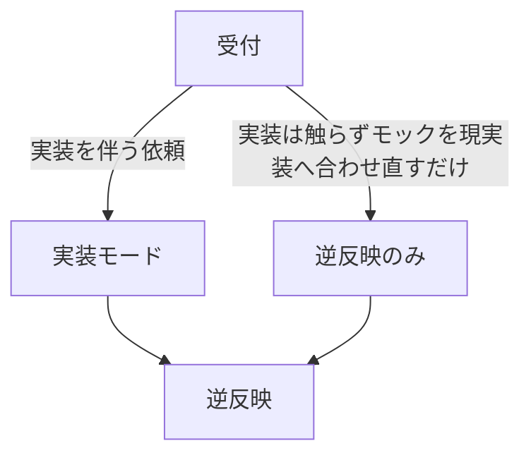

# design-ship — デザインと実装の往復を一つの依頼で閉じる

> 前提: デザイン見本のリポジトリ orbe_design と、内部で使う `ship`（とその先の auto:* 群）はメンテナ私有の環境にある。無い環境ではこのスキルは動かない。

orbe_design（React 製デザインモック）のデザインを正として忠実に実装し、実装の過程で生じたデザイン変更を最後にモックへ書き戻す。完了の定義は「実装のマージ」ではなく「モックが現実を映した状態」——実装後に orbe_design を直しに行く手間と忘れをなくすのがこのスキルの価値。

## 受付

1. **orbe_design を見つける。** 場所はマシンごとに違う。このリポジトリの親ディレクトリの `orbe_design` → `~/github/orbe_design` の順に探し、どちらにも無ければユーザーに聞く。見つけたら `orbe_design/CLAUDE.md` を Read する（モックの構造・編集規律・単一情報源の在り処はここが持つ）。
2. **見本の存在を確かめる。** 依頼対象のシーン・コンポーネントがモックに無ければこのスキルの範囲外。その旨を伝え、通常の `ship` を案内して終了する。
3. **モードを分ける。**

## 実装モード

### 1. デザイン抽出

該当シーンの TSX・`theme.ts`・snapshot 定義を読み、完了条件の材料になる「デザイン抽出」を書き出す:

- 構造（コンポーネント階層・レイアウト）
- 寸法・余白（見本の値そのまま）
- 色（**トークン名で書く**。hex をそのまま写さず theme.ts のトークン名に解決する）
- 状態（既定 / hover / 選択 / 空 / エラー…モックが描き分けている全状態）
- 出典（読んだモックのファイル。逆反映で書き換える場所になる）

### 2. 台帳を開く

`.claude.local/design-ledger/<kebab>.md` を作る。デザインと実装が食い違った点は、判明し次第すべて「見本: X / 実装: Y / 理由: Z / 出典: <モックのファイル>」の形でここに追記する。

### 3. ship に乗る

`Skill` ツールで `ship` を読み込み、デザイン抽出を題材（完了条件の材料）にしてそのフローで実装〜マージまで運ぶ。重ねる差分は2つ:

- **完了条件に「デザイン抽出との一致」を含める。** 理由なき逸脱は不一致。理由のある逸脱だけが台帳に残る。
- **委譲プロンプトに逸脱報告を義務付ける。** auto:plan / auto:implement / auto:review / visual-check へ委譲するたび「デザイン抽出から逸脱した点は『見本: X / 実装: Y / 理由: Z』の形で要約に含めよ」を足し、返ってきた逸脱を台帳へ移す。visual-check の「残した逸脱と理由」も台帳に入れる。

## 逆反映

実装モードではマージ後に、逆反映のみモードでは受付の直後にここへ来る。

1. **変更一覧を確定する。** 実装モードでは台帳が一覧そのもの。空なら「逆反映なし」と報告して終了。逆反映のみモードでは、対象範囲のモックと本番（Swift ソースと `.preview/gallery/*.png`。本番が正）を突き合わせ、ズレを「見本: X / 実装: Y / 出典: <モックのファイル>」で列挙する。
2. **承認を取る。** 一覧を `AskUserQuestion` で提示し、書き戻す項目を選ばせる。承認された項目だけ進める（この承認が書き戻し〜push の許可）。
3. **書き戻す。** orbe_design の該当ファイルを実装後の姿に合わせて書き換える。編集規律と検証コマンド（型チェック・ビルド）は orbe_design/CLAUDE.md に従う（色は theme.ts だけ、件数はリテラルでなく導出、など）。
4. **コミットして push する。** orbe_design リポジトリで承認済みの書き戻しをコミットし、push する。
5. **resync を確認する。** claude.ai/design への同期（`.ds-sync/resync.mjs`。手順とリスクは `.design-sync/NOTES.md`）を今やるかを `AskUserQuestion` で聞き、同意されたときだけ実行する。

最後に、実装（PR・マージ）と逆反映（書き戻した項目・見送った項目・resync の有無）をまとめて報告する。
