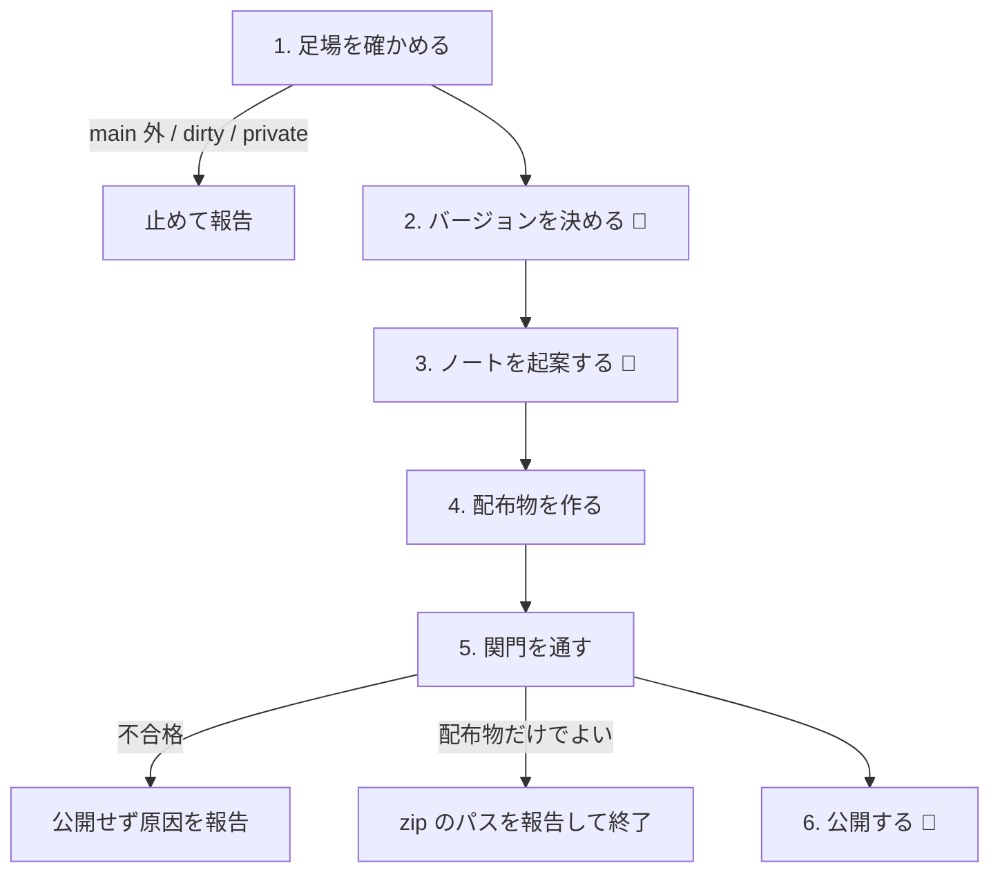

# release — Orbe を世に出す

このスキルが運ぶのは**公開の判断**——次のバージョンを決め、何が変わったかを使う人の言葉にし、不可逆な公開に踏み切ってよいかを確かめる。配布物の生成そのものは `scripts/release-app.sh`（ビルド → Developer ID 署名 → 公証 → staple → zip）が担う。

自分の Mac の `/Applications` に据えるだけなら `local-release`。

## 公開は取り消せない

リリースとは「main のコミットに `vX.Y.Z` タグを打ち、そのタグへ配布物を載せる」こと。Orbe は GPL-3.0-or-later で、バイナリを配る版の対応ソースはこのタグが担う（GPL §6）——だからノートにソース URL を明記する。

タグと Releases は世界に出て取り消せない。だから公開の手前に**4つの関門**（手順5）を置く。**一つでも通らなければ公開に進まない。**

リポジトリが private のときは手順1で止める。非公開リポの Releases は誰にも届かず、ソースを世に出すかは人間だけが下す別の決断——**このスキルはリポジトリの可視性を切り替えない。**

## フロー図

## 手順

### 1. 足場を確かめる
- main にいて、未コミットがなく、`origin` と同期している——手元の中途半端な変更が混ざったビルドを世に出さないため。
- リポジトリが public（`gh repo view --json visibility`）。private なら「ソースの公開が先」と伝えて止まる。

満たさなければそこで止めて何が汚れているかを報告する。

### 2. バージョンを決める
現在値は `app/Info.plist` の `CFBundleShortVersionString`。既存タグ（`git tag -l`）と、前回タグからのコミット（`git log <前回タグ>..HEAD --oneline`）を読む。

semver で次を**理由とともに**提案する（「機能追加が3件・破壊的変更なし → 0.1.0 から 0.2.0」）。既存タグと重複しないことを確かめる。**ユーザーの承認を取る。**

### 3. ノートを起案する
コミットログは材料であって、そのまま並べるものではない。**使う人が何を得るかへ翻訳する。**

- `ship: タブのスピナー停止を修正` → 「エージェント実行中にタブの表示が止まる問題を修正しました」
- 内部リファクタ・CI・テストなど、使う人の体験が変わらないものは落とす
- **末尾に対応ソースを明記する**: `ソース: https://github.com/nakashima-takeo/orbe/tree/vX.Y.Z`（GPL §6）

**ユーザーに見せて直してもらう。**

このノートはアプリ内アップデートの「変更内容」シートにも出る。Markdown で
**見出し（`### 新機能` / `### 改善` / `### 修正`）＋箇条書き**の 3 分類・1リリース5項目までに整える
（シートは見出し＝分類・箇条書き＝項目として描く）。

### 4. 配布物を作る
`app/Info.plist` を新バージョンへ更新してコミットし、push する。手順6のタグはこのコミットに打つので、短縮 SHA を控える（`git rev-parse --short HEAD`）。

- `CFBundleShortVersionString` = 新 semver
- **`CFBundleVersion` = 整数 +1**（次リリースは 2）。Sparkle が新旧比較に使う値で、
  semver 文字列に変えると既存の "1" より小さく比較され自動更新が壊れる。**整数 +1 以外に変えない。**

続けて、手順3のノートを md ファイルに保存し（例: `/tmp/orbe-notes.md`）、
`ORBE_RELEASE_NOTES=/tmp/orbe-notes.md ./scripts/release-app.sh` を実行する
（スクリプトが zip と同名の .md として並置し、`generate_appcast` が appcast の description に埋め込む。
渡し忘れるとノート無しの appcast になる）。成果物は `build/release/orbe-<version>-macos.zip` と
`build/release/appcast.xml`（EdDSA 署名済み。秘密鍵はこの Mac のログイン Keychain——
他マシンでのリリースは鍵の復元が先）。

**公証は待つ。`In Progress` が続いても異常ではない**——Apple は新しい Developer ID の提出を詳細分析にかけ、初回は数時間かかることがある（2回目以降は数分）。**待ちきれずにプロセスを殺さない。** 殺すと署名済み成果物が宙に浮き、staple できなくなる。

### 5. 関門を通す
以下がすべて満たされて初めて公開に進める。

1. **署名・公証** — zip を**別の場所に展開し、`xattr -w -r com.apple.quarantine "0081;$(printf %x $(date +%s));Safari;$(uuidgen)" <app>` でダウンロード状態を再現してから** `spctl -a -vv -t exec <app>`。**`accepted` かつ `source=Notarized Developer ID` でなければ公開しない。** quarantine を付けずに判定しても、受け取った人の状況を再現したことにならない。
2. **バージョン整合** — Info.plist の値とこれから切るタグが一致し、既存タグと重複しない。`CFBundleVersion` が前リリースの整数 +1 になっている（Sparkle の新旧比較値）。
3. **main がクリーン** — 手順1 の状態が保たれている。
4. **起動確認** — ユーザーに zip を展開して起動してもらい、**補完（タブキー）まで試してもらう**。GUI アプリが本当に動くかは人間にしか確かめられず、JavaScriptCore の JIT は補完を使った瞬間に初めて走る。**OK が出るまで公開しない。**

**配布物だけでよい場合は、ここで zip のパスを報告して終わる**（タグも Releases も作らない）。

### 6. 公開する
公開の承認を**一度**取ってから、順に実行する。

1. **タグを打つ** — `git tag vX.Y.Z <手順4のコミット> && git push origin vX.Y.Z`。この瞬間に対応ソースが確定する。
2. **Releases に出す** — `gh release create vX.Y.Z <zip> build/release/appcast.xml --verify-tag --title <title> --notes <ノート>`。`--verify-tag` でタグ未存在時に gh が勝手にタグを作る事故を封じる。
   **`appcast.xml` は必ず zip と並べてアセットに含める**——アプリ内アップデートの `SUFeedURL` は
   `releases/latest/download/appcast.xml`（最新リリースのアセット）を指すため、載せ忘れたリリースを
   1 つ出しただけで全ユーザーの更新確認が 404 になる。これは公開の関門と同格の必須条件。

URL を報告する。

## 前提（一度だけ）

`release-app.sh` には Developer ID 証明書と公証プロファイルが要る。無ければスクリプトが止まる。

- Xcode で「Developer ID Application」証明書を作成
- `xcrun notarytool store-credentials orbe-notary --apple-id <Apple ID> --team-id <Team ID> --password <App用パスワード>`
