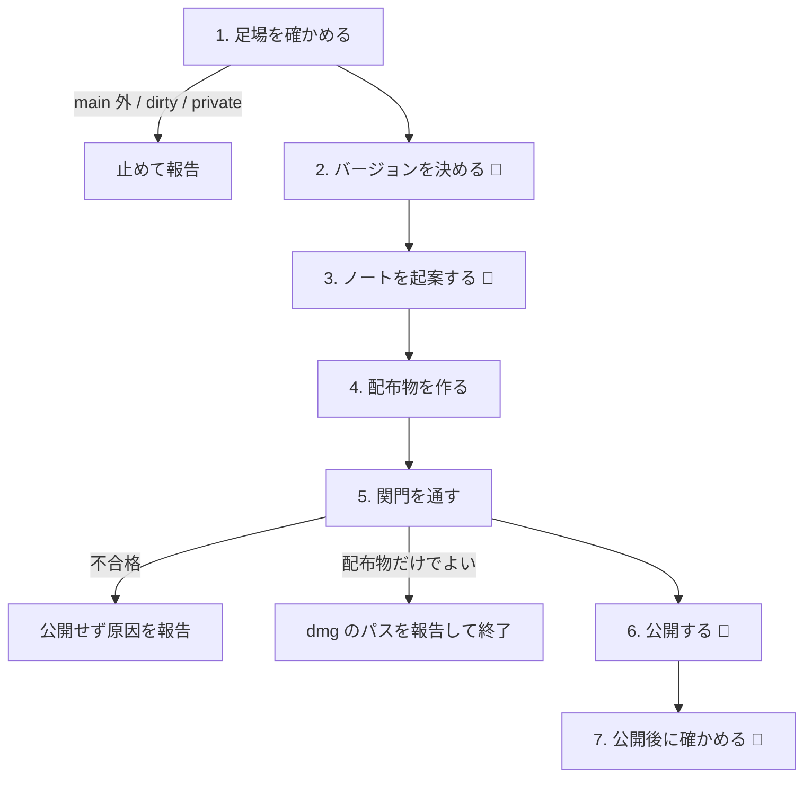

# release — Orbe を世に出す

このスキルが運ぶのは**公開の判断**——次のバージョンを決め、何が変わったかを使う人の言葉にし、不可逆な公開に踏み切ってよいかを確かめる。配布物の生成そのものは `scripts/release-app.sh`（ビルド → Developer ID 署名 → .app 公証・staple → DMG 生成 → DMG 署名・公証・staple → appcast）が担う。

自分の Mac の `/Applications` に据えるだけなら `local-release`。

## 公開は取り消せない

リリースとは「main のコミットに `vX.Y.Z` タグを打ち、そのタグへ配布物を載せる」こと。Orbe は GPL-3.0-or-later で、バイナリを配る版の対応ソースはこのタグが担う（GPL §6）——だからノートにソース URL を明記する。

タグと Releases は世界に出て取り消せない。だから公開の手前に**4つの関門**（手順5）を置く。**一つでも通らなければ公開に進まない。**

リポジトリが private のときは手順1で止める。非公開リポの Releases は誰にも届かず、ソースを世に出すかは人間だけが下す別の決断——**このスキルはリポジトリの可視性を切り替えない。**

## 対象は build-id で名指す

全工程が運ぶのは「あるコミットから焼いた 1 つのバンドル」。それを一意に名乗る値が `OrbeBuildID`（`build-app.sh` が刻む git 短縮 SHA。chrome にも出る）。

**バージョン文字列も bundle ID も取り違えを検出できない**——`dev.orbe.app` は全リリース共通で、`0.3.0` は焼き直せば何度でも作れる。DMG を 1 つ取り違えれば旧版を新版として検証し、そのまま公開へ進む。build-id だけがそれを止める。**DMG をマウントするたび、インスタンスを起こすたび、この値を見る。**

## フロー図


```mermaid
flowchart TD
    A[1. 足場を確かめる] -->|main 外 / dirty / private| S1[止めて報告]
    A --> B[2. バージョンを決める 👤]
    B --> C[3. ノートを起案する 👤]
    C --> D[4. 配布物を作る]
    D --> E[5. 関門を通す]
    E -->|不合格| S2[公開せず原因を報告]
    E -->|配布物だけでよい| Z[dmg のパスを報告して終了]
    E --> F[6. 公開する 👤]
    F --> G[7. 公開後に確かめる 👤]
```

## 手順

### 1. 足場を確かめる
- main にいて、未コミットがなく、`origin` と同期している——手元の中途半端な変更が混ざったビルドを世に出さないため。
- リポジトリが public（`gh repo view --json visibility`）。private なら「ソースの公開が先」と伝えて止まる。

満たさなければそこで止めて何が汚れているかを報告する。

### 2. バージョンを決める
現在値は `app/Info.plist` の `CFBundleShortVersionString`。既存タグ（`git tag -l`）と、前回タグからのコミット（`git log <前回タグ>..HEAD --oneline`）を読む。

semver で次を**理由とともに**提案する（「機能追加が3件・破壊的変更なし → 0.1.0 から 0.2.0」）。既存タグと重複しないことを確かめる。**ユーザーの承認を取る。**

### 3. ノートを起案する
コミットログは材料であって、そのまま並べるものではない。**使う人が何を得るかへ翻訳する。**

- `feat(help): ⌘H ヘルプオーバーレイの入口と骨格を配線する` → `⌘H でヘルプを表示`
- 内部リファクタ・CI・テストなど、使う人の体験が変わらないものは落とす
- **末尾に対応ソースを明記する**: `ソース: https://github.com/nakashima-takeo/orbe/tree/vX.Y.Z`（GPL §6）

このノートはアプリ内アップデートの「変更内容」シートにも出る（見出し＝分類・箇条書き＝項目・それ以外の段落＝マーカー無しの本文として描く。番号付きリスト・コードブロック・引用・表は描かれない）。**見出しはこの 3 種に固定**——`### 新機能` / `### 改善` / `### 修正`。シートは分類の色とマーカーをこの語から決めるので、他の語を使うと中立の意匠になる（描画は [docs/spec/update.md](../../../docs/spec/update.md)）。

**1 項目は 1 行**——箇条書き 1 行に説明を畳み込むと読めない。機能を名指して止め、動作の解説や利点は書かない。補足が要るなら短い括弧 1 つまで。

見本:

```markdown
### 新機能
- `⌘H` でヘルプを表示
- `⇧⌘T` で閉じたエージェントタブを開き直す
- タブを中クリックで閉じる
- worktree の作成場所を設定 `worktree-dir` で変更可能に

### 改善
- コマンド補完が `~/.zshrc` を書き換えない方式に（旧版が追記した行は起動時に削除）

ソース: https://github.com/nakashima-takeo/orbe/tree/v0.3.0
```

**ユーザーに見せて直してもらう。**

### 4. 配布物を作る
`app/Info.plist` を新バージョンへ更新する。

- `CFBundleShortVersionString` = 新 semver
- **`CFBundleVersion` = 前リリースの整数 +1**。Sparkle が新旧比較に使う値で、semver 文字列に変えると既存の整数より小さく比較され自動更新が壊れる。**整数 +1 以外に変えない。**

**main は直 push できない**（PR 必須・必須チェック 2 件）。バージョン更新は PR で入れ、CI が通ったらマージし、`git pull` で main を進める。**ビルドはその後**——build-id はビルド時の HEAD の SHA なので、マージ前にビルドすると build-id が PR 側のコミットを指し、タグを打つマージコミットとズレる。タグを打つコミットの短縮 SHA を控える（`git rev-parse --short HEAD`）。

続けて、手順3のノートを md ファイルに保存し（例: `/tmp/orbe-notes.md`）、
`ORBE_RELEASE_NOTES=/tmp/orbe-notes.md ./scripts/release-app.sh` を実行する
（スクリプトが DMG と同名の .md として並置し、`generate_appcast` が appcast の description に埋め込む。
渡し忘れるとノート無しの appcast になる）。成果物は `build/release/orbe-<version>-macos.dmg` と
`build/release/appcast.xml`（EdDSA 署名済み。秘密鍵はこの Mac のログイン Keychain——
他マシンでのリリースは鍵の復元が先）。**.app と DMG の二重公証があるため、初回は公証を 2 回待つ。**

**公証は待つ。`In Progress` が続いても異常ではない**——Apple は新しい Developer ID の提出を詳細分析にかけ、初回は数時間かかることがある（2回目以降は数分）。**待ちきれずにプロセスを殺さない。** 殺すと署名済み成果物が宙に浮き、staple できなくなる。

### 5. 関門を通す
以下がすべて満たされて初めて公開に進める。

1. **署名・公証** — 受領者を再現する。**DMG に `xattr -w -r com.apple.quarantine "0081;$(printf %x $(date +%s));Safari;$(uuidgen)" <dmg>` でダウンロード状態を付与 → `hdiutil attach <dmg> -mountpoint <dir> -nobrowse` でマウント → マウント内の `Orbe.app` を** `codesign --verify --deep --strict --verbose=2 <app>` と `spctl -a -vv -t exec <app>` で検証する。**codesign が pass し、spctl が `accepted` かつ `source=Notarized Developer ID` でなければ公開しない。** quarantine を付けずに判定しても、受け取った人の状況を再現したことにならない。**マウント先は必ず指定する**——自動命名は同名ボリュームが既にあると `/Volumes/Orbe 1` へ逃げるので、古い DMG が張りっぱなしのとき別バージョンを検証してしまう。このマウントは関門4 でも使うので張ったままにする。
2. **同一性** — マウント内 `Orbe.app` の `OrbeBuildID`（`/usr/libexec/PlistBuddy -c "Print :OrbeBuildID" <app>/Contents/Info.plist`）が手順4 で控えた SHA と一致する。`CFBundleShortVersionString` がこれから切るタグと一致し、既存タグと重複しない。`CFBundleVersion` が前リリースの整数 +1（Sparkle の新旧比較値）。
3. **main がクリーン** — 手順1 の状態が保たれている。
4. **起動確認** — **`/Applications` には入れない。** `sandbox-run` を呼び、関門1 でマウントした `Orbe.app` を対象に隔離インスタンスとして起こす。ユーザーに触ってもらい、**補完（タブキー）まで**試してもらう。GUI アプリが本当に動くかは人間にしか確かめられず、JavaScriptCore の JIT は補完を使った瞬間に初めて走る。**OK が出るまで公開しない。** 終わったら sandbox-run の片付けに続けて `hdiutil detach <dir>` でアンマウントする。

   `/Applications/Orbe.app` の旧版は**そのまま残す**。手順7 の更新経路検証はこれを材料にする——旧版が手元にあるのはリリース直前だけで、上書きすると二度と作れない。

**配布物だけでよい場合は、ここで dmg のパスを報告して終わる**（タグも Releases も作らない）。

### 6. 公開する
公開の承認を**一度**取ってから、順に実行する。

1. **タグを打つ** — `git tag vX.Y.Z <手順4のコミット> && git push origin vX.Y.Z`。この瞬間に対応ソースが確定する。
2. **Releases に出す** — `gh release create vX.Y.Z build/release/orbe-X.Y.Z-macos.dmg build/release/appcast.xml --verify-tag --title <title> --notes-file <手順4のノート>`。`--verify-tag` でタグ未存在時に gh が勝手にタグを作る事故を封じる。
   **`appcast.xml` は必ず dmg と並べてアセットに含める**——アプリ内アップデートの `SUFeedURL` は
   `releases/latest/download/appcast.xml`（最新リリースのアセット）を指すため、載せ忘れたリリースを
   1 つ出しただけで全ユーザーの更新確認が 404 になる。これは公開の関門と同格の必須条件。

### 7. 公開後に確かめる
公開して初めて確かめられるものが 2 つある。**ここまでが 1 回のリリース。**

1. **feed が引ける** — `curl -sL https://github.com/nakashima-takeo/orbe/releases/latest/download/appcast.xml` が 200 を返し、`sparkle:shortVersionString` が今出した版であること。`SUFeedURL` はこの URL 固定なので、appcast.xml の載せ忘れも latest の付き方の誤りも、ここでしか露見しない。
2. **旧版から更新できる** — 関門4 で温存した `/Applications/Orbe.app` を起動し、「更新を確認」から検出 → ダウンロード → 再起動適用まで**ユーザーに通してもらう**。変更内容シートに手順3 のノートが出る。EdDSA 署名と Sparkle の経路が本当に繋がっているかは、通すまで誰も知らない。

URL を報告する。

## 前提（一度だけ）

`release-app.sh` には Developer ID 証明書と公証プロファイルが要る。無ければスクリプトが止まる。

- Xcode で「Developer ID Application」証明書を作成
- `xcrun notarytool store-credentials orbe-notary --apple-id <Apple ID> --team-id <Team ID> --password <App用パスワード>`
