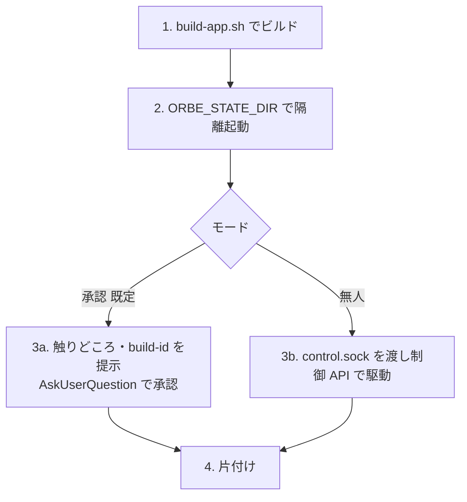

# sandbox-run — 隔離した使い捨て Orbe で動作を確かめる

Orbe の新ビルドを、本物の Orbe（常用の workspaces・control.sock）に**一切触れず**、`ORBE_STATE_DIR` で隔離した使い捨てインスタンスとして起こして動作を確かめる。claude 自身が検証対象の Orbe 内で動いていても、**本物を止めずに新ビルドを検証できる**のが要。確かめ終えたら使い捨てインスタンスは必ず消す。

二モードで使う（呼び出し目的で排他分岐）:
- **承認モード（既定）**: 人間が触って承認する。ship の実機確認、手元の変更を試したい時。
- **無人モード**: 承認ゲートを飛ばし、隔離インスタンスの control.sock を渡して制御 API で駆動する。自動化スキル（機械検証の Agent 等）向け。

## 常時効くレンズ（全モード共通）

- **本物に絶対触れない ― ① state 隔離。** 起動は必ず `ORBE_STATE_DIR="$(mktemp -d)"` を付ける（workspaces・control.sock がそのディレクトリ直下へ隔離される）。付け忘れると常用環境を汚す。
- **本物に絶対触れない ― ② 環境隔離。** 継承した親 Orbe の resource ポインタ（`GHOSTTY_RESOURCES_DIR`・`TERMINFO`・`GHOSTTY_BIN_DIR` ほか、Orbe/ghostty 由来の継承 var。非網羅の代表）を起動時に断つ。**`ORBE_STATE_DIR` は Orbe の state しか隔離せず、プロセス環境は素通りする**——sandbox-run は多くが Orbe の端末内から起動され、その子が親の env を継ぐと新ビルドの ghostty が**旧 `/Applications` バンドルの資産を名前解決**する（chrome は新色・端末だけ旧色という偽描画になり、実機確認が phantom バグに化ける）。断てば新ビルドは自バンドルを解決する。何が継がれているかは `env | grep -iE 'GHOSTTY|ORBE'` で確かめて落とす。
- **`open` は使わない。** `open` は起動中のインスタンスを前面化するだけで新ビルドに入れ替わらない。バイナリを直接叩く（`./build/Orbe.app/Contents/MacOS/Orbe`）。
- **使い捨ては必ず片付ける。** 承認・NG・失敗のいずれで終わっても、起こした隔離インスタンスを kill し、その state dir を消す。`kill しない`のは本物の Orbe だけ。

## 手順

1. **ビルドする。** `./scripts/build-app.sh`。前提不足（フル Xcode 未導入・zig 失敗など）での失敗は出力メッセージ（`docs/BUILD.md` 参照）に従う。
2. **隔離起動する。** 継承した Orbe/ghostty の env を断って起こす（レンズ②）:
   `env -u GHOSTTY_RESOURCES_DIR -u GHOSTTY_BIN_DIR -u TERMINFO -u ORBE_SOCK ORBE_STATE_DIR="$(mktemp -d)" ./build/Orbe.app/Contents/MacOS/Orbe &`
   `env | grep -iE 'GHOSTTY|ORBE'` で他の継承 var が残っていればそれも `-u` で足す。この state dir と PID を控える（片付けに使う）。隔離インスタンスは自前の control.sock（`$ORBE_STATE_DIR/control.sock`）を持つ。
3. モードで分岐:
   - **承認モード（既定）**: 今回の変更が**どこに現れ・何を触って見るか**と、画面 chrome の **build-id が今ビルドした値か**を短く提示する（人間目視が必須の条件があればここで渡す）。`AskUserQuestion` で承認を問う。**この承認が後続（確定・マージ等）の許可**。NG・指摘があれば呼び出し側へ差し戻す。
   - **無人モード**: `$ORBE_STATE_DIR/control.sock` を呼び出し側へ渡し、制御 API で駆動して確かめる。
4. **片付ける。** 隔離インスタンスを kill し、state dir を消す。承認・NG・失敗のいずれでも必ず行う。

## Orbe の契約（このスキルが依存するもの）

- **`ORBE_STATE_DIR`**: 非空ならその直下へ workspaces・control.sock を隔離する（`StateDir` / `OrbePaths`）。全実行体（GUI・`orb` CLI・MCP）が同一解決を共有する。
- **`./scripts/build-app.sh`**: `./build/Orbe.app` を生成し、末尾に build-id を出す。
- **build-id 表示**: chrome（`StatusRowView`）に build-id が出る。新ビルドへ入れ替わったかの確認手段。
- **`GHOSTTY_RESOURCES_DIR`（継承 env）**: ghostty が theme・shell-integration・terminfo を名前解決する起点。**Orbe が子プロセスへ export する**ため、Orbe 端末内から起こした sandbox は放置すると親（＝旧 `/Applications`）バンドルを解決する。unset すれば ghostty は実行体（＝新バンドル）から自己解決する。
- **control.sock**: `$ORBE_STATE_DIR/control.sock`。隔離インスタンスを制御 API で駆動する口。
