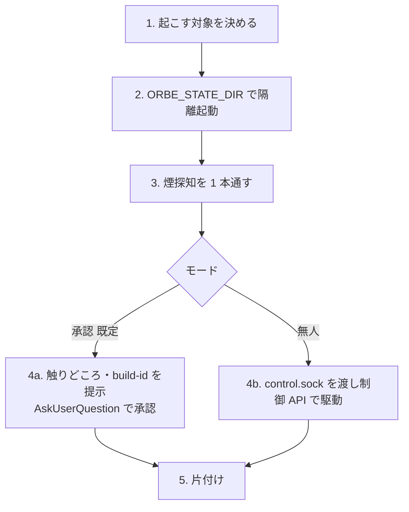

# sandbox-run — 隔離した使い捨て Orbe で動作を確かめる

Orbe の新ビルドを、本物の Orbe（常用の workspaces・control.sock）に**一切触れず**、`ORBE_STATE_DIR` で隔離した使い捨てインスタンスとして起こして動作を確かめる。claude 自身が検証対象の Orbe 内で動いていても、**本物を止めずに新ビルドを検証できる**のが要。確かめ終えたら使い捨てインスタンスは必ず消す。

二モードで使う（呼び出し目的で排他分岐）:
- **承認モード（既定）**: 人間が触って承認する。ship の実機確認、手元の変更を試したい時。
- **無人モード**: 承認ゲートを飛ばし、隔離インスタンスの control.sock を渡して制御 API で駆動する。自動化スキル（機械検証の Agent 等）向け。

## 常時効くレンズ（全モード共通）

- **本物に絶対触れない ― ① state 隔離。** 起動は必ず `ORBE_STATE_DIR="$(mktemp -d)"` を付ける（workspaces・control.sock がそのディレクトリ直下へ隔離される）。付け忘れると常用環境を汚す。**`mktemp -d` より深い場所を選ばない**——control.sock は AF_UNIX の `sun_path` 104 バイト上限を超えると**警告も出さずに無効化される**（socket が作られないだけ）。症状は「補完が出ない」「制御 API に繋がらない」という遠い場所に出て、アプリのバグに見える。
- **本物に絶対触れない ― ② 環境隔離。** 起動前に、親 Orbe がタブへ注入した**インスタンス・バンドル・シェルの環境**をユーザー環境へ戻す。`ORBE_STATE_DIR` は state しか隔離せず、プロセス環境は素通りする。親の `ORBE_SOCK` / `ORBE_TAB`、バンドル内を指す `ORBE_REPORT_BIN` / ghostty リソース変数、補完 shim を指す `ZDOTDIR` を残すと、隔離インスタンスが本物へ接続したり旧バンドルの資産を読んだりする。新ビルドが自分の state・バンドル・補完 shim を据え直せる環境にしてから起こす。
- **`open` は使わない。** `open` は起動中のインスタンスを前面化するだけで新ビルドに入れ替わらない。バイナリを直接叩く（`<app>/Contents/MacOS/Orbe`）。**DMG から起こすときはマウント先を指定する**（`hdiutil attach <dmg> -mountpoint <dir> -nobrowse`）——自動命名は同名ボリュームが既にあると `/Volumes/Orbe 1` へ逃げるので、古い DMG が張りっぱなしのとき別バージョンを起こす。
- **使い捨ては必ず片付ける。** 承認・NG・失敗のいずれで終わっても、手順2 で控えた PID を kill し、その state dir を消す。

## 手順


```mermaid
flowchart TD
    A[1. 起こす対象を決める] --> B[2. ORBE_STATE_DIR で隔離起動]
    B --> S[3. 煙探知を 1 本通す]
    S --> M{モード}
    M -->|承認 既定| C[4a. 触りどころ・build-id を提示<br/>AskUserQuestion で承認]
    M -->|無人| D[4b. control.sock を渡し制御 API で駆動]
    C --> E[5. 片付け]
    D --> E
```

1. **起こす対象を決める。** 既定は `./scripts/build-app.sh` でビルドした `./build/Orbe.app`（前提不足＝フル Xcode 未導入・zig 失敗などでの失敗は出力メッセージ〔`docs/guides/build.md` 参照〕に従う）。呼び出し元が別のバンドルを渡したときはそれを使う（公証済み DMG 内の `Orbe.app` など）。**対象の build-id を控える**（`/usr/libexec/PlistBuddy -c "Print :OrbeBuildID" <app>/Contents/Info.plist`）。
2. **隔離起動する。** 親 Orbe の注入層を外してから起こす（レンズ②）。次の形で state dir と PID を明示的に控える:

   ```zsh
   sandbox_state_dir="$(mktemp -d)"
   sandbox_env=(env
     -u ORBE_STATE_DIR -u ORBE_SOCK -u ORBE_TAB
     -u ORBE_REPORT_BIN -u ORBE_BUNDLE_ID -u ORBE_USER_ZDOTDIR
     -u GHOSTTY_RESOURCES_DIR -u GHOSTTY_BIN_DIR -u GHOSTTY_SURFACE_ID
     -u GHOSTTY_SHELL_FEATURES -u GHOSTTY_ZSH_ZDOTDIR -u TERMINFO
   )

   if [[ -n "${ORBE_USER_ZDOTDIR-}" ]]; then
     sandbox_env+=(ZDOTDIR="$ORBE_USER_ZDOTDIR")
   elif [[ -n "${ORBE_BUNDLE_ID-}" ]]; then
     sandbox_env+=(-u ZDOTDIR)
   fi

   "${sandbox_env[@]}" ORBE_STATE_DIR="$sandbox_state_dir" \
     <app>/Contents/MacOS/Orbe &
   sandbox_pid=$!
   ```

   `ORBE_USER_ZDOTDIR` があれば親 GUI（`CompletionShim.activate()`）が据えたユーザー本来の `ZDOTDIR` を渡す。無くても親 Orbe 内（`ORBE_BUNDLE_ID` あり）なら親 shim を指す `ZDOTDIR` を消す。Orbe 外からの起動ではユーザー自身の `ZDOTDIR` をそのまま保つ。隔離インスタンスは自前の control.sock（`$sandbox_state_dir/control.sock`）を持つ。
3. **煙探知を 1 本通す（両モード共通）。** `.app` の起動経路と `AppDelegate` の配線は `swift test` の守備範囲外なので、機械的に確かめる場所はここしかない。人間に見せる前に死んだバンドルを弾く意味もあるので、承認モードでも飛ばさない。
   - まず `$sandbox_state_dir/control.sock` が現れるまで待つ（最大 10 秒）。GUI の起動から `ControlServer` が bind するまでには実時間があるので、待たずに叩くと健全なバンドルを不合格にする。最後まで現れなければ起動経路が `ControlServer` を張っていないということなので失敗。
   - **必ず手順2 で控えた state dir の sock へ直接投げる。** 手元の Orbe MCP ツール（`mcp__orbe__*`）は `ORBE_STATE_DIR` を持たず**常用インスタンス**に繋がる。使うと利用者の実タブに目印が打ち込まれたうえ、起こしたバンドルについて何も測らないまま緑になる。以降の API 呼び出しには、次の `sandbox_rpc <method> '<params の JSON>'` を使う（Python 3 が必要）。

     **応答の改行まで受信してから接続を閉じる。** `ControlServer` はクライアントから EOF を受けると接続を閉じるため、送信側も応答を読むまで開いたままにする。受信待ちには 5 秒のタイムアウトを設け、空応答・途中切断・JSON-RPC エラーは終了コードで失敗を伝える。

     ```zsh
     sandbox_rpc() {
       python3 - "$sandbox_state_dir/control.sock" "$@" <<'PY'
     import json
     import socket
     import sys

     request = {"jsonrpc": "2.0", "id": 1, "method": sys.argv[2],
                "params": json.loads(sys.argv[3])}
     with socket.socket(socket.AF_UNIX, socket.SOCK_STREAM) as sock:
         sock.settimeout(5)
         sock.connect(sys.argv[1])
         sock.sendall((json.dumps(request) + "\n").encode())
         with sock.makefile("rb") as stream:
             line = stream.readline()
     if not line.endswith(b"\n"):
         sys.exit("control.sock: 応答の改行前に切断されました")
     response = json.loads(line)
     if response.get("id") != request["id"]:
         sys.exit("control.sock: 応答の id が一致しません")
     if "error" in response:
         sys.exit(json.dumps(response["error"], ensure_ascii=False))
     print(json.dumps(response["result"], ensure_ascii=False))
     PY
     }

     sandbox_rpc list_tabs '{}'
     ```

   - `list_tabs` でタブを取り、`send_text` に `echo L4D""ONE_<id>` を送る（`<id>` は毎回ランダム。目印の途中に**空のダブルクォート 2 つ**を挟む）。続けて `send_key enter` を送り、`get_tab_text` に連結形 `L4DONE_<id>` が現れるまで**最大 15 秒**ポーリングする。
   - 目印をコマンド行の中で 2 つのリテラルに割るのが要点で、連結形はシェルが引用符除去を**評価した**出力にしか現れない。入力行がそのまま描き返されても目印にはならないので、実 `.app` ＝利用者の rc とテーマが走る環境でも判定が揺れない。
   - 15 秒で出なければ、起こしたバンドルは制御 API から駆動できていない。駆動も承認も始めず、失敗として呼び出し側へ返す。
4. モードで分岐:
   - **承認モード（既定）**: 今回の変更が**どこに現れ・何を触って見るか**と、画面 chrome の **build-id が手順1 で控えた値か**を短く提示する（人間目視が必須の条件があればここで渡す）。`AskUserQuestion` で承認を問う。**この承認が後続（確定・マージ等）の許可**。NG・指摘があれば呼び出し側へ差し戻す。
   - **無人モード**: `$sandbox_state_dir/control.sock` を呼び出し側へ渡し、制御 API で駆動して確かめる。
5. **片付ける。** 隔離インスタンスを kill し、state dir を消す。承認・NG・失敗のいずれでも必ず行う。

## Orbe の契約（このスキルが依存するもの）

- **`ORBE_STATE_DIR`**: 非空ならその直下へ workspaces・control.sock を隔離する（`StateDir` / `OrbePaths`）。全実行体（GUI・`orb` CLI・MCP）が同一解決を共有し、`orb`/`orbe-mcp` は `ORBE_STATE_DIR` 併用時に継承 `ORBE_SOCK` を無視する（隔離インスタンス操作が実 Orbe へ逸れない）。
- **`./scripts/build-app.sh`**: `./build/Orbe.app` を生成し、末尾に build-id を出す。
- **build-id**: `build-app.sh` が git 短縮 SHA を `Info.plist` の `OrbeBuildID` に刻み、chrome（`StatusRowView`）が表示する。**バンドルの同一性を名乗る唯一の値**——バージョン文字列も bundle ID も、版が違っても同じ値を取りうる。
- **親 Orbe の注入 env**: `ORBE_SOCK` / `ORBE_TAB` は親インスタンス、`ORBE_REPORT_BIN` / `ORBE_BUNDLE_ID` と `GHOSTTY_*` / `TERMINFO` は親バンドル、`ZDOTDIR` は親の補完 shim を指す。`ORBE_USER_ZDOTDIR` は GUI（`CompletionShim.activate()`）が据えたユーザー本来の値なので、除去前に `ZDOTDIR` へ復元する。親の注入層を外せば、新 Orbe が各値を自分の state とバンドルから構成する。
- **control.sock**: `$ORBE_STATE_DIR/control.sock`。隔離インスタンスを制御 API で駆動する口。
