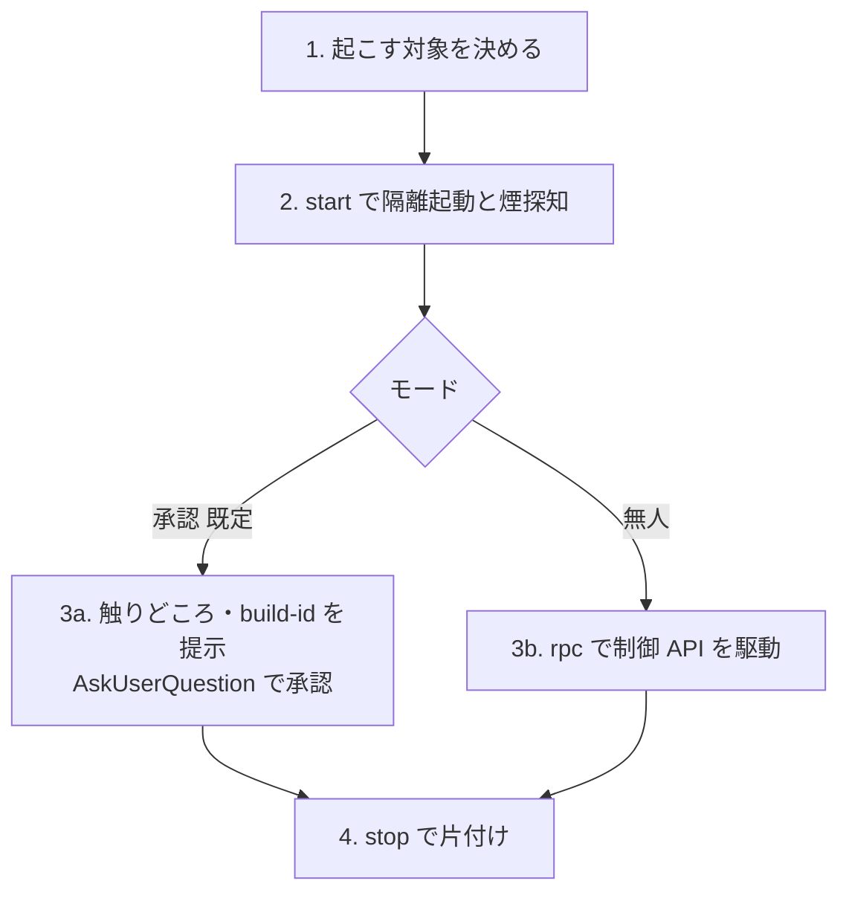

# sandbox-run — 隔離した使い捨て Orbe で動作を確かめる

Orbe の新ビルドを、本物の Orbe（常用の workspaces・control.sock）に**一切触れず**、`ORBE_STATE_DIR` で隔離した使い捨てインスタンスとして起こして動作を確かめる。claude 自身が検証対象の Orbe 内で動いていても、**本物を止めずに新ビルドを検証できる**のが要。起こす・叩く・片付けるの実体は `scripts/sandbox-run.sh` が持つ（state の隔離、親 Orbe が注入した環境の除去、control.sock の待機、煙探知、片付け）。

二モードで使う（呼び出し目的で排他分岐）:
- **承認モード（既定）**: 人間が触って承認する。ship の実機確認、手元の変更を試したい時。
- **無人モード**: 承認ゲートを飛ばし、隔離インスタンスを制御 API で駆動する。自動化スキル（機械検証の Agent 等）向け。

## 常時効くレンズ（全モード共通）

- **隔離インスタンスへの操作は `scripts/sandbox-run.sh rpc` だけで行う。** 手元の Orbe MCP ツール（`mcp__orbe__*`）と `orb` CLI は**常用インスタンス**に繋がる。使うと利用者の実タブに目印が打ち込まれたうえ、起こしたバンドルについて何も測らないまま緑になる。
- **DMG から起こすときはマウント先を指定する**（`hdiutil attach <dmg> -mountpoint <dir> -nobrowse`）。自動命名は同名ボリュームが既にあると `/Volumes/Orbe 1` へ逃げるので、古い DMG が張りっぱなしのとき別バージョンを起こす。
- **使い捨ては必ず片付ける。** 承認・NG・失敗のいずれで終わっても `stop` を通す。片付けが走らなくても 60 分で自壊するが、それは保険であって手順ではない。

## 手順

```mermaid
flowchart TD
    A[1. 起こす対象を決める] --> B[2. start で隔離起動と煙探知]
    B --> M{モード}
    M -->|承認 既定| C[3a. 触りどころ・build-id を提示<br/>AskUserQuestion で承認]
    M -->|無人| D[3b. rpc で制御 API を駆動]
    C --> E[4. stop で片付け]
    D --> E
```

1. **起こす対象を決める。** 既定は `./scripts/build-app.sh` でビルドした `./build/Orbe.app`（前提不足＝フル Xcode 未導入・zig 失敗などでの失敗は出力メッセージ〔`docs/guides/build.md` 参照〕に従う）。呼び出し元が別のバンドルを渡したときはそれを使う（公証済み DMG 内の `Orbe.app` など）。
2. **`./scripts/sandbox-run.sh start [<app>]` を実行する。** 隔離起動から煙探知までを通し、`state_dir` / `sock` / `pid` / `build_id` / `log` を出す。煙探知は `.app` の起動経路と `AppDelegate` の配線を機械的に確かめる唯一の場所なので、承認モードでも飛ばさない。失敗（control.sock が現れない・目印が出ない）は自分で片付けて非 0 で返るので、駆動も承認も始めず、失敗として呼び出し側へ返す。
3. モードで分岐:
   - **承認モード（既定）**: 今回の変更が**どこに現れ・何を触って見るか**と、画面 chrome の **build-id が手順2 の `build_id` か**を短く提示する（人間目視が必須の条件があればここで渡す）。`AskUserQuestion` で承認を問う。**この承認が後続（確定・マージ等）の許可**。NG・指摘があれば呼び出し側へ差し戻す。
   - **無人モード**: `./scripts/sandbox-run.sh rpc <state_dir> <method> '<params の JSON>' [<timeout 秒>]` で制御 API（`docs/spec/control/api.md`）を駆動して確かめる。`prompt_agent` / `wait_for_event` のように待つメソッドは、その `timeoutMs` より長い timeout 秒を渡す。
4. **`./scripts/sandbox-run.sh stop <state_dir>` で片付ける。** 承認・NG・失敗のいずれでも必ず行う。

## Orbe の契約（このスキルが依存するもの）

- **`ORBE_STATE_DIR`**: 非空ならその直下へ workspaces・control.sock を隔離する（`StateDir` / `OrbePaths`）。全実行体（GUI・`orb` CLI・MCP）が同一解決を共有し、`orb`/`orbe-mcp` は `ORBE_STATE_DIR` 併用時に継承 `ORBE_SOCK` を無視する（隔離インスタンス操作が実 Orbe へ逸れない）。
- **`./scripts/build-app.sh`**: `./build/Orbe.app` を生成し、末尾に build-id を出す。
- **build-id**: `build-app.sh` が git 短縮 SHA を `Info.plist` の `OrbeBuildID` に刻み、chrome（`StatusRowView`）が表示する。**バンドルの同一性を名乗る唯一の値**——バージョン文字列も bundle ID も、版が違っても同じ値を取りうる。
- **control.sock**: `$ORBE_STATE_DIR/control.sock`。隔離インスタンスを制御 API で駆動する口。
