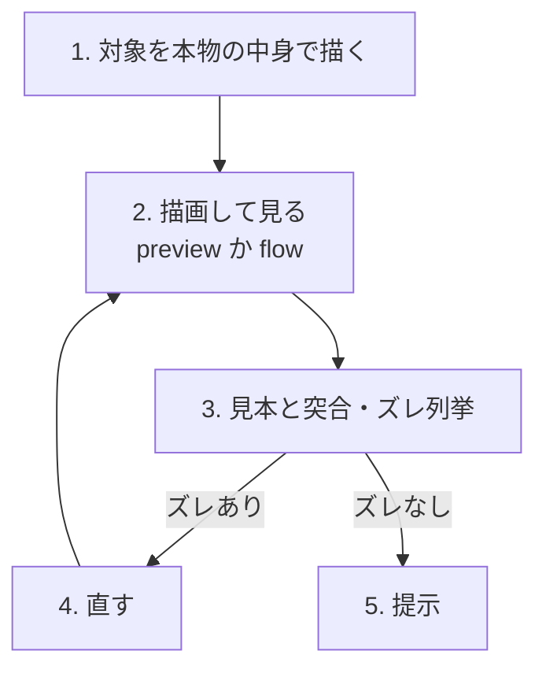

# visual-check — chrome を design 見本とピクセル突合する

> 前提: 見本の正典「Claude Design プロジェクト（Design MCP）」はメンテナ私有で、このリポジトリには同梱しない。見本に到達できない環境では `docs/design-system.md` §2 トークン・§5 準拠で判断する（後述の fallback）。

Orbe の chrome（DiffPanel・パレット・Onboarding 等の SwiftUI 部分）の**見た目**を、本物の中身で preview に描き、Claude Design の見本とピクセル単位で突き合わせ、一致するまで直す自走ループ。値・色・型・状態の正は `docs/design-system.md`（§2 トークン〜§5 コンポーネント全状態、§3 アクセシビリティ契約）。着手時に関係する節を Read で開く。

**範囲**: 見た目だけ。focus 越境・IME・Cmd+G 等のランタイム挙動は対象外。

## 常時効くレンズ（全ステップで効かせる）

- **見本があれば基本ピクセルパーフェクト。** Claude Design に対応する見本があるなら、寸法・余白・色・字種を見本の値そのままに合わせる。「だいたい」で寄せない。理由のある逸脱（型スケール4段に丸める等）だけ、その理由を添えて残す。
- **見本が無ければトークン・原則準拠。** `design-system.md` §2 のトークンと §5 の状態表で判断する。生 hex を書かず `Theme` / `Color.theme` 経由。
- **§3 のアクセシビリティ契約。** 追加=緑/削除=赤・成功=緑✓/エラー=赤⚠、かつ色だけに意味を載せず文字・形・位置でも差をつける（二重符号化）。詳細は `design-system.md` §3。
- **preview は fixture が張った条件しか映さない。** 実物が崩れる最悪条件——長い行（折返し・省略・横溢れ）・多い行・全幅の塗り・word-diff・空/エラー等——を fixture に寄せる。OK 判定は「条件を張った fixture で崩れていない」まで。

## 手順

1. **本物の中身を fixture で描く（stub 禁止）。** 検証対象のビューを、本物のデータ（`FileDiff` / `ConflictBlock` 等）を流した `#Preview` で描く。無ければ `Sources/Orbe/EditorPane/EditorPaneFixtures.swift` / `Tests/OrbeTests/DesignSceneFixtures.swift` の流儀で fixture を足す。`NSView()` 等のスタブで外枠だけ描かない——壊れるのは中身なので、中身を描かない検証は検証にならない。
2. **描画して自分で見る。** preview で出せる静止状態は `./scripts/preview-gallery.sh`（全 story を `.preview/gallery/` へ書き出し自動で開く）か Xcode の Preview キャンバス。**preview で出せない状態（アクションで初めて現れる画面）は flow で描く**: `./scripts/preview-flows.sh <flow名>`（その画面だけを `.preview/flows/` へ撮って開く。引数なしで全画面）。検証対象の状態を網羅する（既定 / hover / 選択 / 空 / エラー等、§5 の状態表に対応させる）。
3. **見本と1項目ずつ突合し、ズレを列挙する。** 対応する見本を Claude Design（Design MCP: project files を列挙 → 該当 HTML を Read）で取得し、見本の参照幅に合わせて並べる。**寸法・余白・色・字種・状態の符号化を1項目ずつ照合**し、ズレを「見本: X / 実物: Y / 差: Z」の形で書き出す。「だいたい合っている」で止めない。**ズレがゼロ**（＝見本の値そのまま。理由のある逸脱だけ理由付きで残る）なら 5 へ。見本が無ければレンズのトークン / §5 準拠を確認する。
4. **直して 2 に戻る。** 列挙したズレを潰し、再描画して再突合する（ループ）。
5. **一致した一枚を提示。** 合わせた項目・残した逸脱とその理由を添えて報告する。

## Orbe の道具

- **preview の足場（静止 fixture）**: `scripts/preview-gallery.sh`（出力は `.preview/gallery/`・gitignore 済）。fixture は `Sources/Orbe/.../*Fixtures.swift`（`#if DEBUG`・本物のデータを本物のビューに流す）。
- **flow の足場（preview で出せない状態用）**: `scripts/preview-flows.sh <flow名>`（出力は `.preview/flows/`・gitignore 済）。本物のアクションを順に呼んで初めて現れる画面（drillIn 後のサブメニュー・query 絞り込み・導入の進行・scroll 追従・overflow 等）を撮る。引数なしで全画面、`<flow名>` でその1画面だけ。flow 定義は `Tests/OrbeTests/DesignFlowSnapshotTests.swift`。
- **見本**: Claude Design プロジェクト（Design MCP）。「diff パネル 完成版」等の実 HTML が正。
- **正の値**: `docs/design-system.md`（§2 トークン / §3 色規律 / §5 状態表）・`docs/tokens.json`（機械可読ミラー）。
