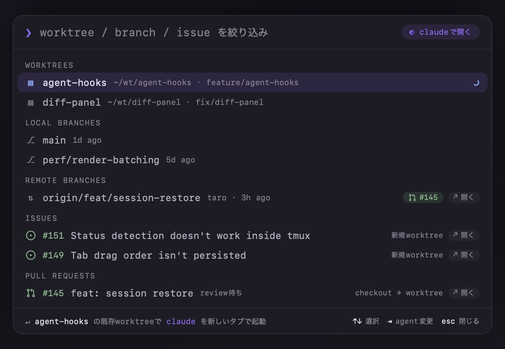
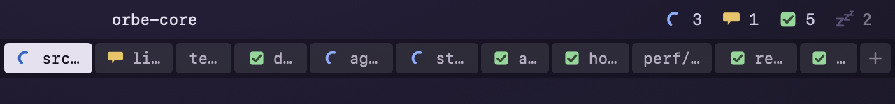
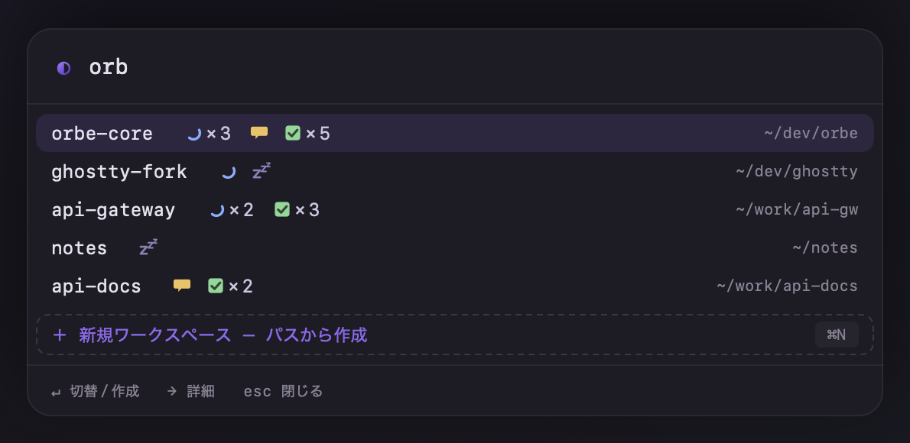
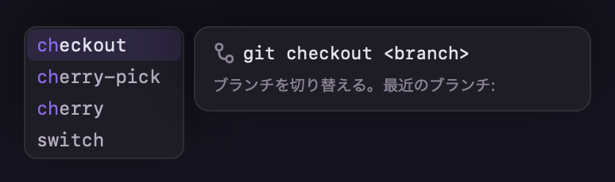

<div align="center">

<picture>
  <source media="(prefers-color-scheme: dark)" srcset="docs/assets/logo-dark.svg">
  
</picture>

# Orbe

**AI コーディングエージェントのためのネイティブ macOS ターミナル**

[](https://github.com/nakashima-takeo/orbe/actions/workflows/ci.yml)
[](https://github.com/nakashima-takeo/orbe/releases/latest)
[](#インストール)
[](LICENSE)

[インストール](#インストール) · [機能](#機能) · [ショートカット](#キーボードショートカット) · [ソースからビルド](#ソースからビルド)

</div>

---

AI エージェントとの開発は、コードを書く時間より「段取り」に手を取られる——Issue を確認し、worktree を切り、`cd` して、エージェントを起動し、タブを行き来して入力待ちのエージェントを探す。

**Orbe はその段取りを丸ごとターミナルに畳み込む。**

<div align="center">
  
</div>

- **ワンアクションで開発が始まる** — Issue / PR / ブランチを選んで Enter。worktree の作成からエージェント起動済みタブが開くまでが 1 アクション。
- **並列でも迷子にならない** — 全タブ・全ワークスペースのエージェント状態（作業中 / 入力待ち / 完了）を常時表示。「どれが待ってるんだっけ」が無くなる。
- **AI がターミナル自体を運転できる** — MCP ブリッジ経由で、エージェントがタブを開き、画面を読み、キーを送れる。

土台は [Ghostty](https://ghostty.org) のターミナルエンジン **libghostty** を静的リンクした、Metal GPU 描画の本物のターミナル。その上のすべての UI を SwiftUI / AppKit で描く。Electron や Web 技術は使っていない。

## インストール

[**最新リリースの DMG をダウンロード**](https://github.com/nakashima-takeo/orbe/releases/latest)して、`Orbe.app` を Applications にドラッグするだけ。

- macOS 14.0 以降。配布バイナリは Apple Silicon 用（Intel Mac は[ソースからビルド](#ソースからビルド)）
- Developer ID 署名・Apple 公証済み
- 以降の更新はアプリ内自動アップデート（Sparkle）が静かに追従する

## 機能

### Dispatch — 作業開始を 1 アクションに

`⌘⇧X` で、worktree・ブランチ・GitHub Issue / PR が 1 枚のパレットに並ぶ。選んで Enter すると、worktree を（無ければ）隔離ディレクトリに自動作成し、そこでエージェント——または素のシェル——が起動した状態のタブが開く。「Issue を見て、worktree を切って、cd して、起動する」がすべて消える。

### エージェントの並列運用



PATH 上のエージェント CLI（claude / codex / agy）を自動検出。`⌘⇧C` で現在の cwd を引き継いだ新タブにデフォルトエージェントが一発起動する。各エージェントの状態はタブのインジケータと画面上部のストリップに**全ワークスペース横断**で集計され、入力待ちや完了を見逃さない。アプリを再起動しても、保存されたセッションから会話ごと自動 resume。

### ワークスペース



案件ごとにタブ群・作業ディレクトリ・設定を丸ごと分離した名前付きワークスペース。`⌘⇧S` で瞬時に切替、フォルダ選択や `git clone` からの新規作成も `⌘N` から。フォント・テーマ・デフォルトエージェントなど、**どの設定もワークスペース単位で上書きできる**（`⌘,`）。

### IDE 級のコマンド補完



入力中のコマンドラインに、カーソル追従のドロップダウンで候補と説明を表示（zsh）。[fig](https://github.com/withfig/autocomplete) の補完 spec を解釈し、`git checkout <Tab>` で実ブランチ名が出るような動的候補にも対応。使うほど頻度を学習して並び順が育ち、日本語 IME の変換中は自動で引っ込む。

### 自動化 — `orb` CLI・制御 API・MCP

同梱の `orb` コマンドで、Orbe 自身の設定・ワークスペース・ペイン・タブをスクリプトから操作できる。裏側は Unix socket 上の JSON-RPC 2.0 制御チャネルで、MCP ブリッジ（`orbe-mcp`）を立てれば **AI がターミナル自体を運転できる**——テキスト注入・画面テキスト取得・状態イベントの購読まで。

| 実行体 | 役割 |
|---|---|
| `Orbe.app` | ターミナル本体（libghostty を静的リンク） |
| `orb` | `config` / `ws` / `pane` / `tab` サブコマンド（同梱） |
| `orbe-report` | エージェント CLI の hook から状態を報告（同梱） |
| `orbe-mcp` | MCP(stdio) を制御チャネルへ転送するブリッジ（非同梱・`.mcp.json` から起動） |

### 細部まで

- スクロールバック検索（`⌘F`）・分割ペイン・タブの D&D 並び替え・その場リネーム（`⌘R`）
- JetBrains Mono Nerd Font 同梱——設定なしでアイコンが描画され、CJK 字形はヒラギノに固定
- 背景の透過・ブラー、WCAG AA コントラストをテストで機械保証した Dark / Light テーマ
- 日英 UI を再起動なしで即時切替
- アプリ内自動アップデート——ダウンロードは裏で済み、再起動または終了時に適用

## キーボードショートカット

覚えるのは**パレットの開き方だけ**。どのパレットも操作は共通——打鍵で絞り込み、`↑↓` で選び、Enter で決定、`←` で戻る。

| キー | 動作 |
|---|---|
| `⌘⇧X` | Dispatch（Issue / PR / ブランチ / worktree から作業開始） |
| `⌘⇧C` / `⌘⇧A` | デフォルトエージェント起動 / エージェントを選んで起動 |
| `⌘⇧S` | ワークスペース切替 |
| `⌘,` | 設定パレット |
| `⌘T` / `⌘D` / `⌘⇧D` | 新タブ / 左右分割 / 上下分割 |
| `⌘F` | スクロールバック検索 |

## ソースからビルド

フル Xcode と Zig 0.15.2 が必要。詳細は **[docs/BUILD.md](docs/BUILD.md)**。

```bash
git submodule update --init --recursive
./scripts/build-app.sh
open build/Orbe.app
```

現状仕様は [docs/spec/](docs/spec/) にある。

## 既知の制限

- **危険ペーストの確認ダイアログが出ない。** 上流 Ghostty は改行を含むペースト等で確認を求めるが、Orbe は現状これを無条件で許可する。Web ページからコピーしたコマンドがそのまま実行されうるため、貼り付ける内容は自分で確認すること（確認 UI は v1.1 で対応予定）。
- コマンド補完は zsh のみ（bash / fish、tmux / ssh 先では無効）。
- 配布バイナリは Apple Silicon 専用。Intel Mac はソースビルドで動く。

## ライセンス

Orbe は [GPL-3.0-or-later](LICENSE)。Copyright (C) 2026 Takeo Nakashima

同梱する第三者ソフトウェア（libghostty(MIT)、JetBrains Mono / JuliaMono(OFL-1.1)、swift-markdown(Apache-2.0)、補完エンジン(MIT) 等）の帰属は [NOTICE](NOTICE)、ライセンス全文は [licenses/](licenses/) に置く。`vendor/` 配下の第三者由来ファイルは上流のライセンスを維持する（Orbe が書いたファイルは他と同じく GPL-3.0-or-later）。
