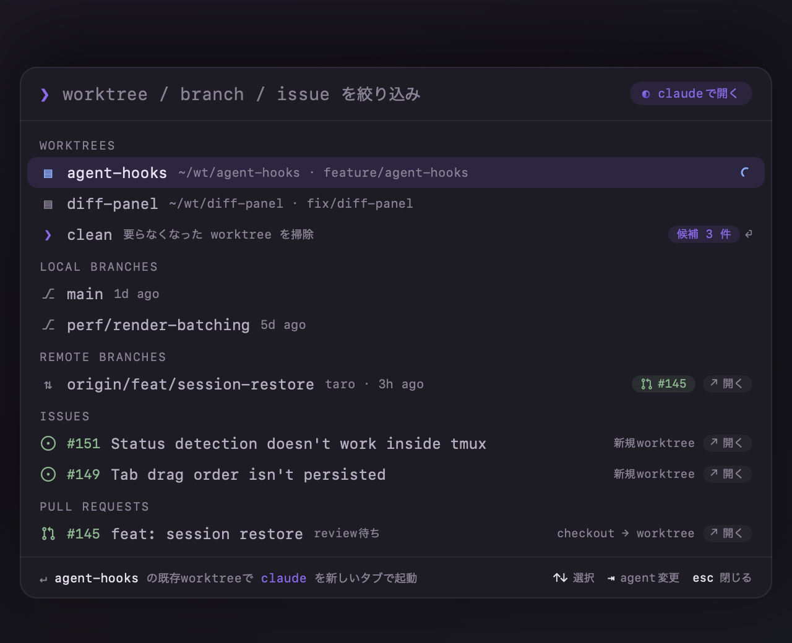
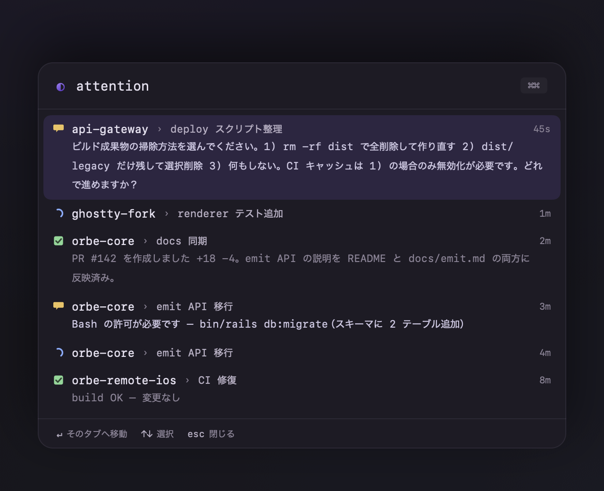

<div align="center">

<picture>
  <source media="(prefers-color-scheme: dark)" srcset="docs/assets/logo-dark.svg">
  
</picture>

# Orbe

**AI コーディングエージェントとの並列開発を支える、macOS ネイティブターミナル**

[](https://github.com/nakashima-takeo/orbe/actions/workflows/ci.yml) [](https://github.com/nakashima-takeo/orbe/releases/latest) [](#インストール) [](LICENSE)

[インストール](#インストール) · [機能](#機能) · [ショートカット](#キーボードショートカット) · [CLI・MCP](#cli-と-mcp) · [開発ドキュメント](docs/README.md)

</div>

Orbe は、作業場所の準備、エージェントの起動、入力待ち・完了の確認をまとめて扱うターミナルです。Issue / PR / ブランチを選ぶと、Git worktree を用意し、エージェントを起動したタブを開けます。複数のプロジェクトを並行して進めるときも、各エージェントの状態を一覧できます。

ターミナルエンジンは [Ghostty](https://ghostty.org) の **libghostty**。Metal で描画し、アプリの UI は SwiftUI / AppKit で実装しています。

<!-- 画像の生成: ORBE_GALLERY=1 swift test --filter DesignGallerySnapshotTests/testRenderGallery
     .preview/gallery/dispatch_design{,_light}.png → docs/assets/hero-dispatch{,-light}.png
     .preview/gallery/attention_palette{,_light}.png → docs/assets/attention{,-light}.png -->
<p align="center">
  <picture>
    <source media="(prefers-color-scheme: light)" srcset="docs/assets/hero-dispatch-light.png">
    
  </picture>
  <br>
  <em>Dispatch（⌘⇧X）で作業を選び、Enter で開始。画像は現行 UI にサンプルデータを表示したものです。</em>
</p>

## インストール

配布アプリの対象は **macOS 14.0 以降 / Apple Silicon** です。

1. [最新リリース](https://github.com/nakashima-takeo/orbe/releases/latest)の Assets から `.dmg` をダウンロードします。
2. DMG を開き、`Orbe.app` を「アプリケーション」へドラッグします。

配布アプリは Developer ID 署名・Apple 公証済みです。更新はアプリ内で確認・ダウンロードし、再起動または終了時に適用します。自動更新の設定は `⌘,` から変更できます。

### 連携ツールの準備

エージェント CLI は別途インストールし、各 CLI でログインを済ませてください。Orbe はシェルの `PATH` から `claude` / `codex` / `agy` を検出します。エージェントを入れずに通常のシェルとして使うこともできます。

| 使いたい機能 | 必要な準備 |
|---|---|
| エージェントの起動・状態表示 | `claude` / `codex` / `agy` のいずれかと、初回案内でのプラグイン導入 |
| ブランチ・worktree の操作 | `git` コマンドが使えること |
| GitHub Issue / PR の表示 | `origin` が GitHub.com のリポジトリと、[GitHub CLI](https://cli.github.com)（`gh auth login` で認証） |

### 最初の作業を始める

1. **Orbe を起動**し、表示言語とデフォルトエージェントを選びます。初回案内で、検出済み CLI に[状態追跡プラグイン](docs/spec/agent/plugin-package.md)を登録します。
2. **`⌘N` でワークスペースを作成**します。既存フォルダを指定するか、リポジトリ URL から `git clone` できます。
3. **`⌘⇧X` で Dispatch を開き**、ブランチ・worktree・Issue・PR を選んで **Enter**。必要な worktree が用意され、新しいタブでエージェントが起動します。**Tab** で別のエージェントや通常のシェルに切り替えられます。
4. エージェントを複数動かしたら、**Command キーを単独で 2 回押す**（`⌘⌘`）と状態を一覧できます。行を選んで Enter を押すと、そのタブへ移動します。

現在の作業ディレクトリでエージェントを起動するだけなら `⌘⇧C`、エージェントを選んで起動するなら `⌘⇧A` を使います。

## 機能

### worktree の作成から片付けまで

Dispatch は既存の worktree を再利用し、必要なときだけ新しく作成します。GitHub の情報が取得できなくても、ローカルのブランチ・worktree は操作できます。

作業後は同じパレットの **`clean` 行**から、不要になった worktree をまとめて削除できます。使用中・未コミット変更あり・未マージなどの状態を確認して対象を選びます。作成先は既定でリポジトリの隣の `<リポジトリ名>-worktrees/`。`⌘,` の設定から変更できます。詳しくは [Dispatch の仕様](docs/spec/palette/dispatch.md)を参照してください。

### エージェントの状態を見渡す

タブと画面上部に作業中・入力待ち・完了などの状態を表示します。**Attention**（`⌘⌘`）では、作業中・入力待ち・完了のエージェントをワークスペース横断で一覧し、質問や完了メッセージを確認して該当タブへ移動できます。

<p align="center">
  <picture>
    <source media="(prefers-color-scheme: light)" srcset="docs/assets/attention-light.png">
    
  </picture>
</p>

Orbe が背面にあるときは、macOS のメニューバーから入力待ち・完了を確認できます。見ていないタブでの状態変化は通知音でも知らせます。音の種類・音量・オン／オフはワークスペースごとに設定でき、手持ちの音源も使えます。

状態表示は各 CLI の hook に依存します。`agy` は作業中・完了に対応し、入力待ちは取得できません。詳しくは [Attention](docs/spec/palette/attention.md)・[メニューバー](docs/spec/chrome/menubar.md)・[通知音](docs/spec/agent/sound.md)を参照してください。

### プロジェクトごとに作業場所を分ける

ワークスペースは、名前・作業ディレクトリ・タブ・設定をまとめる単位です。`⌘⇧S` で切り替えられ、同じ Git worktree のタブは隣り合うグループにまとまり、識別色が付きます。1 タブにつき 1 つの端末を持ち、ドラッグで並べ替え、`⌘R` で名前を変更できます。

`⌘,` でフォント・テーマ・背景の透過・デフォルトエージェントなどを設定できます。これらはアプリ全体の設定を継承しつつ、ワークスペース単位で上書きできます。表示言語（日英）と自動更新はアプリ全体の設定です。

### 再起動後や、閉じたタブから作業を再開する

ワークスペース・タブ・作業ディレクトリは保存され、次回起動時に復元されます。エージェントのセッション ID が記録されていれば、タブを起動するときに各 CLI の再開コマンドで会話を引き継ぎます。通常のシェルは保存されたディレクトリで新しく起動します。

**`⌘⇧T`** では、現在のワークスペースで閉じたエージェントを一覧し、1 件ずつ復元できます。通常のシェルタブや、セッション ID を取得できなかったエージェントはこの一覧の対象外です。複数セッションの一括復元には `orb session` を使えます。詳しくは [復元の仕様](docs/spec/platform/persistence.md)と[閉じたエージェント](docs/spec/palette/closed-agents.md)を参照してください。

### ターミナルの基本操作

zsh では、コマンド・オプション・パスの補完候補を説明付きで表示します。Git ブランチなどの動的候補、利用頻度に応じた並べ替え、日本語 IME との共存に対応しています。

スクロールバック検索（`⌘F`）、フォントサイズ変更、Dark / Light テーマを備え、JetBrains Mono Nerd Font を同梱しています。操作一覧は **`⌘H` のヘルプ**で確認できます。

## キーボードショートカット

`⌘` は Command、`⇧` は Shift です。パレットの基本操作は `↑↓` で選択、Enter で決定、Esc で戻る・閉じる。検索やサブメニューなど、その画面で使える操作はフッターに表示されます。

| キー | 動作 |
|---|---|
| `⌘⇧X` | Dispatch を開く |
| `⌘⇧C` / `⌘⇧A` | デフォルトエージェントを起動 / エージェントを選んで起動 |
| `⌘⌘` | Attention を開く（Orbe が前面のとき、Command 単独を 2 回） |
| `⌘N` / `⌘⇧S` | ワークスペースを作成 / 切り替え |
| `⌘T` / `⌘W` | 新しいシェルタブ / タブを閉じる |
| `⌘⇧T` | 閉じたエージェントの一覧から復元 |
| `⌘⇧←` / `⌘⇧→` | 前のタブ / 次のタブ |
| `⌘R` | タブの名前を変更 |
| `⌘⇧E` | 現在の作業ディレクトリを GUI エディタで開く |
| `⌘F` | スクロールバックを検索 |
| `⌘,` | 設定を開く |
| `⌘H` | ヘルプを開く・閉じる（Orbe ではこのキーをヘルプに割り当て） |

## CLI と MCP

同梱の **`orb`** で、設定・ワークスペース・タブ・エージェント・セッション履歴を操作できます。Orbe 内のシェルタブでは `PATH` に自動で追加されます。

```bash
orb ws list                     # ワークスペース一覧
orb tab list --json              # タブとエージェント状態を JSON で取得
orb agent spawn                 # デフォルトエージェントを新しいタブで起動
orb session closed              # 閉じたままのエージェントセッションを確認
orb --help                      # コマンド一覧
```

`orb agent prompt` で別タブのエージェントへ指示して応答を待ち、`orb tab text` で端末の表示内容を取得できます。引数・終了コードは [CLI リファレンス](docs/spec/control/cli.md)を参照してください。

MCP クライアントからも **`orbe-mcp`** を介してタブの起動・テキスト取得・入力・エージェントへの指示を行えます。ブリッジは配布アプリには同梱されず、リポジトリの [`scripts/orbe-mcp.sh`](scripts/orbe-mcp.sh) がソースからビルドして起動します。

利用する場合は、このスクリプトの絶対パスを MCP クライアントに stdio サーバーの起動コマンドとして登録してください。既定の接続先は **Orbe Dev**。配布版へ接続する場合は、MCP クライアントから `ORBE_SOCK` に配布版の `control.sock` の絶対パスを渡します。接続先の解決規則と公開ツールは [制御 API・MCP の仕様](docs/spec/control/api.md)にあります。

## ソースからビルド

**フル Xcode（Xcode 26 系）・Metal Toolchain・Zig 0.15.2** を用意してください。Command Line Tools だけではビルドできません。ツールの導入・環境確認は[ビルドガイド](docs/guides/build.md)にまとめています。

```bash
git clone --recurse-submodules https://github.com/nakashima-takeo/orbe.git
cd orbe
./scripts/build-app.sh
open build/Orbe.app
```

既に clone 済みのリポジトリでは、`git submodule update --init --recursive` を実行してからビルドします。Git worktree で開発する場合の submodule の扱いは[ビルドガイド](docs/guides/build.md)を参照してください。

ビルドスクリプトは libghostty のコンパイルとアプリのバンドル生成を行います。既定の成果物は **Orbe Dev** です。配布版 Orbe と共存し、設定・タブの保存先も分かれます。開発には SwiftPM を使い、Xcode プロジェクトファイルはありません。

テストは libghostty をビルドした後、次のコマンドで実行できます。lint・format の手順も[ビルドガイド](docs/guides/build.md)にあります。

```bash
swift build --build-tests
swift test --skip-build
```

全体構成と機能ごとの仕様は **[開発ドキュメント](docs/README.md)**、テストの考え方は[テストアーキテクチャ](docs/testing/test-architecture.md)を参照してください。不具合・機能要望は [GitHub Issues](https://github.com/nakashima-takeo/orbe/issues)で受け付けています。

## 既知の制限

- **改行を含む貼り付けなどに確認ダイアログは出ません。** 内容によっては貼り付けたコマンドがそのまま実行されるため、貼り付け前に確認してください。
- **Orbe のコマンド補完はローカルの zsh が対象**です。bash / fish、tmux 内、SSH 先は対象外です。
- **会話の再開には各 CLI 側にセッションが残っている必要があります。** 実行中プロセスやシェルの出力履歴を保存・復元する機能はありません。

## ライセンス

[GPL-3.0-or-later](LICENSE)。Copyright (C) 2026 Takeo Nakashima。

第三者ソフトウェアの帰属は [NOTICE](NOTICE)、ライセンス全文は [licenses/](licenses/) を参照してください。`vendor/` 内の第三者由来ファイルは、それぞれのライセンスに従います。
