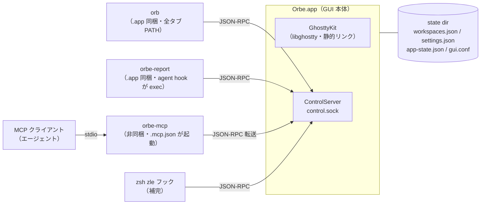

# 全体構成

Orbe は GUI 本体 1 つと CLI 3 つの計 4 実行体からなる（ほかに配布しない dev CLI が 1 つ）。すべて 1 つの SwiftPM パッケージ（`Package.swift`）でビルドされ、Xcode プロジェクトは持たない。個々の仕様は [spec/](spec/README.md)、ビルド手順は [guides/build.md](guides/build.md) が持つ。

## 実行体と接続



| 実行体 | 役割 | 依存 | spec |
|---|---|---|---|
| `Orbe.app` | ターミナル本体。libghostty を静的リンクし Metal 描画 | GhosttyKit・swift-markdown・Sparkle | [terminal/core](spec/terminal/core.md) |
| `orb` | Orbe 自身を操作する CLI（config / ws / tab / agent / wait） | Foundation のみ | [control/cli](spec/control/cli.md) |
| `orbe-report` | エージェント CLI の hook から状態を報告 | Foundation のみ | [agent/notify](spec/agent/notify.md) |
| `orbe-mcp` | MCP（stdio）を制御チャネルへ転送するブリッジ | Foundation のみ | [control/api](spec/control/api.md) |
| `orbe-sound` | 通知音の制作ループ CLI（dev 専用・`.app` 非同梱・制御チャネルに繋がない） | Foundation・OrbeSound | [agent/sound](spec/agent/sound.md) |

制御チャネルに繋がる 4 実行体は `OrbePaths`（`Sources/OrbePaths/`）を共有する。state dir と control.sock の解決規則を 1 箇所に閉じ、同じチャネルでビルドされた GUI と CLI が必ず同じ socket を見ることを構造で保証する薄い土台。同じく GUI 本体と `orbe-sound` は `OrbeSound`（`Sources/OrbeSound/`）を共有し、通知音は両者で同じ合成定義から鳴る。

**制御チャネル**が外部→Orbe の唯一の操作面で、Unix socket 上の改行区切り JSON-RPC 2.0（[control/api](spec/control/api.md)）。エージェント状態報告・`orb` の全サブコマンド・MCP ツール・コマンド補完（[palette/completion](spec/palette/completion.md)）がすべてここに集約される。

## state dir

`~/Library/Application Support/<bundle-id>/` 直下（`ORBE_STATE_DIR` で隔離可）。bundle ID がチャネルごとに違うため、dev と release は state を共有せず同時起動できる（[platform/channel](spec/platform/channel.md)）。

| ファイル | 中身 | spec |
|---|---|---|
| `workspaces.json` | workspace・タブ・cwd・エージェントセッション・ウィンドウサイズ | [platform/persistence](spec/platform/persistence.md) |
| `settings.json` | ユーザー設定（global 層） | 同上 |
| `app-state.json` | アプリの内部簿記（PATH キャッシュ・UI 言語など） | 同上 |
| `gui.conf` | 設定パレットが再生成する ghostty conf の最終層 | [platform/config](spec/platform/config.md) |
| `control.sock` | 制御チャネルの Unix socket | [control/api](spec/control/api.md) |

## Sources/ モジュール構成

```
Sources/
  Orbe/                  GUI 本体（実行ターゲット）
    App/                 起動・AppState・メニュー・state dir（AppDelegate.swift ほか）
    Core/
      Terminal/          libghostty 埋め込み（SurfaceView・入力・描画）
      Git/               git 実行層（AppKit 非依存）
      Localization/      日英 2 言語 i18n コア
    Features/            機能単位（Agent / Attention / Chrome / Completion /
                         Control / Dispatch / Help / MenuBar /
                         Search / Settings / Sound / Update / Workspace）
    DesignSystem/        トークン・パレット・共有コンポーネント（正は design/）
  OrbePaths/             state dir / control.sock 解決の共有土台（Foundation のみ）
  OrbeSound/             通知音の純 DSP 層（合成語彙・カタログ・レンダラ・取り込み・解析。Foundation のみ）
  orbe-cli/              orb 実行ターゲット
  orbe-mcp/              MCP ブリッジ実行ターゲット
  orbe-report/           状態報告実行ターゲット
  orbe-sound/            通知音の制作ループ CLI（dev 専用・非同梱）
```

spec の領域フォルダ（[spec/README.md](spec/README.md)）は概ね `Features/` 配下の単位に対応する。`app/` にはバンドル素材（Info.plist・既定 conf・テーマ・エージェントプラグイン・zsh shim・補完エンジン）が置かれ、`scripts/build-app.sh` が `.app` へ焼き込む。

## 環境変数

Orbe が**タブへ注入する**もの（外部契約。CLI・hook・補完が読む）:

| 変数 | 意味 | spec |
|---|---|---|
| `ORBE_TAB` | タブ自身の ID | [agent/notify](spec/agent/notify.md) |
| `ORBE_SOCK` | このインスタンスの control.sock 絶対パス | 同上 |
| `ORBE_REPORT_BIN` | 同梱 `orbe-report` の絶対パス | 同上 |
| `ORBE_BUNDLE_ID` | チャネル identity（dev/release 判別） | 同上 |
| `ZDOTDIR` | zsh shim（補完の自動有効化） | [palette/completion](spec/palette/completion.md) |

Orbe が**読む**もの（利用者・スクリプトが立てる）:

| 変数 | 意味 | spec |
|---|---|---|
| `ORBE_STATE_DIR` | state dir の隔離（検証用インスタンス） | [platform/persistence](spec/platform/persistence.md) |
| `ORBE_CHANNEL` | ビルド時のチャネル選択（`build-app.sh` の入力） | [platform/channel](spec/platform/channel.md) |
| `GHOSTTY_RESOURCES_DIR` | 非バンドル起動時のみ ghostty リソースの所在 | [guides/build.md](guides/build.md) |

## 外部依存

- **libghostty** — `vendor/ghostty` submodule を固定 SHA に pin し、自前ビルドした xcframework を `binaryTarget` で取り込む。外部契約は [terminal/libghostty](spec/terminal/libghostty.md)。
- **swift-markdown**（Apache-2.0） — リリースノート（appcast description）の markdown 描画。
- **Sparkle**（MIT） — アプリ内アップデート（[platform/update](spec/platform/update.md)）。
- **git / gh** — サブプロセスとして実行。gh は無くても劣化動作（[palette/dispatch](spec/palette/dispatch.md)）。
- **補完エンジン** — `vendor/completion-engine/` の prebuilt JS バンドル（[palette/completion](spec/palette/completion.md)）。

帰属の正は `NOTICE`（[platform/licensing](spec/platform/licensing.md)）。
